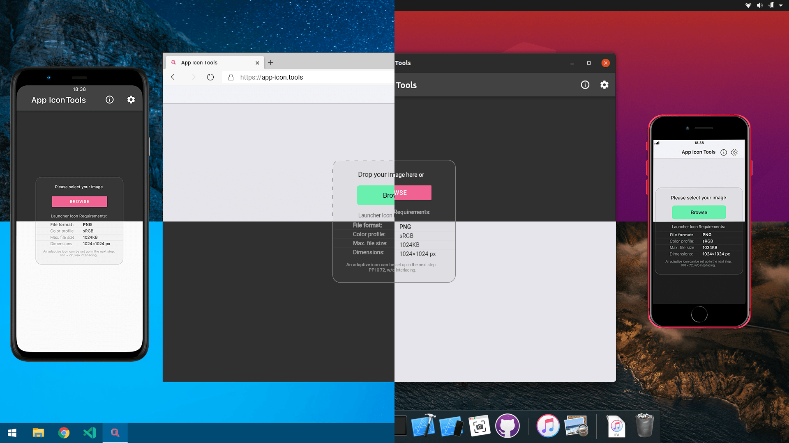

# App Icon Tools 🛠️

## Table of content

* [Description](#Description)
* [Key Features](#Key-Features)
* [Try it online](#Try-it-online)
* [Releases](#Releases)
* [More Info](#More0Info)

## Description

This multiplatform app is **powered by Flutter** and was created for simple and intuitive preview and generation of (launcher/desktop) app icons, for the most popular operating systems. It doesn't contain tracking or any advertising and is available for free as an open-source. PRs, suggestions, translations, etc. – are welcome!

## Key Features

Here are some of the unique features of this application:

* It creates icons not only for Android and iOS but for **all platforms that Flutter supports** (at the moment, the Linux platform from Flutter not have app icon, but once the Flutter team fixes [this issue](https://github.com/flutter/flutter/issues/53229), everything is ready).
* It **works locally** (even in PWA form) on your device and **does not send your files to any servers**.
* It will **find and show you the issues that can cause you problems** with displaying or app Stores refusal.
* It can **show icons in different shapes** and **safety zone** masks.
* It can exclusively **preview the parallax animation of adaptive Android icons**, since [adapticon.tooo.io](https://adapticon.tooo.io) is gone.
* It **shows the icons as they would look on real devices**, and all devices here are not just photos, but vector images — ready for 16K.
* It **generates icons not destructive way** — all you get is an archive, the contents of which you can check before you overwrite your files.
* For additional information, it will **forward you to a website with official documentation** for each platform.
* It **works natively on all platforms** that Flutter supports.
* The project **supports multiple languages**, and you can easily add your own.
* This app is made for both developers and designers, and in the end, the generated icons can be used not only for Flutter applications. Just give it a try!

## Try it online

This project in form of PWA **will only run on most recent browsers, with Chromium (Chrome, Edge, etc.) engine v83 or Firefox v77 and newer**. However, I would not recommend a Firefox now, since drag and drop don't work there yet. Don't even try to run it on Safari, Internet Explorer and so on — they can't handle it!

Just follow this link and run it in your modern browser:

[app-icon.tools](https://app-icon.tools)

## Releases

You can find binaries for **Windows, Linux, macOS, Android, iOS and PWA** in [Releases](https://github.com/tsinis/app_icon_tools/releases) section of this GitHub repository.

## More Info

For further information, credits, licenses, attributions, tech. data, instructions (e.g. on localization or building this app), troubleshooting of known problems, FAQ, etc. — [**welcome to Wiki!**](https://github.com/tsinis/app_icon_tools/wiki)
